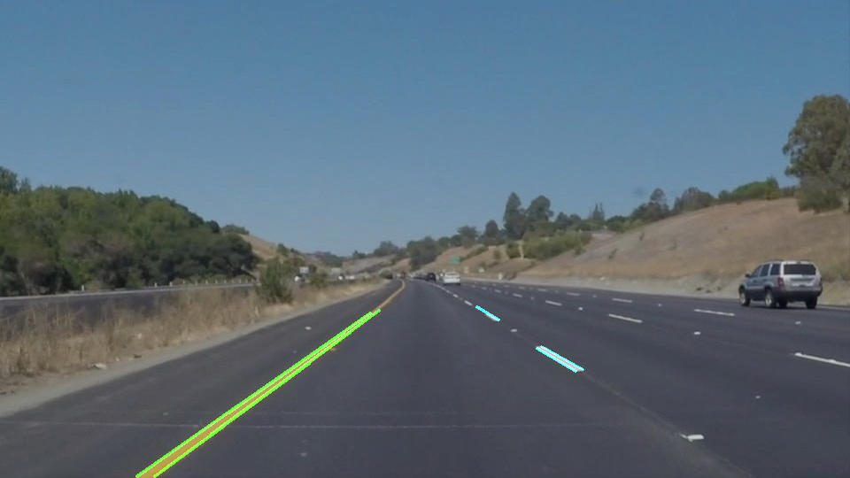
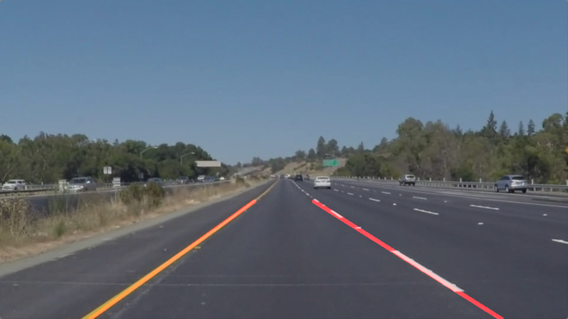

# **Finding Lane Lines on the Road** 

# Overview

When we drive, we use our eyes to decide where to go.  The lines on the road that show us where the lanes act as our constant reference for where to steer the vehicle.  Naturally, one of the first things we would like to do in developing a self-driving car is to automatically detect lane lines using an algorithm.

In this project, I've developed a pipeline to detect lane lines in images using Python and OpenCV. OpenCV means "Open-Source Computer Vision", which is a package that has many useful tools for analyzing images.  

# Results

The algorithm was applied to the test videos located in the [test_videos/](test_videos/) directory.
Below you can see how the videos were processed be the algorithm.

1. solidWhiteRight.mp4

2. solidYellowLeft.mp4

3. challenge.mp4

# Reflection

## 1. The pipeline

My pipeline consisted of 6 steps:
- converting the images to grayscale
- applying a Blur filter
- applying the Canny edges detector
- finding a region of interest
- using the Hough algorithm for finding lines
- drawing a single line on the left and right lanes

**1.1. Converting the images to grayscale**

First, I converted the images to grayscale using `cv2.cvtColor(img, cv2.COLOR_RGB2GRAY)`.

**1.2. Applying a Blur filter**

Then I applied a Blur filter with kernel size equal to 5. This default value worked well for me.

**1.3. Applying the Canny edges detector**

Choosing the low and high thresholds I wanted to get rid of as many noise as I can, meanwhile keeping enough "useful" pixels.
After running a plenty of tests I chose 30 and 60 as the values of the low and high threshold respectively.

**1.4. Finding a region of interest**

At this step I tried to exclude from the region of interest as many useless pixels as I can.
The final region of interest looks like this:

**1.5. Using the Hough algorithm for finding lines**

This step was challenging as I needed to choose parameters which must work well for all the test videos.
I found two video frames on which my pipeline did not work well, and tuned the
parameters until the algorithm gives good results.

Frame 1:

Frame 2

**1.6. Drawing a single line on the left and right lanes**

In order to draw a single line on the left and right lanes, I modified the `draw_lines()` function by adding 4 steps:
- Assigning all the lines to the left and right lanes (meanwhile filtering horizontal lines). The result of this step looks like this:
  
- Calculating average slope and x-intercept for the left and right lanes
- Filtering the slope and x-intercept using low pass filters. I decided to use a
  low pass filter to make my pipeline less sensitive to a noise. It was a crucial step for getting acceptable results for the last video.
- Extrapolating the lines to get the final result.
  

## 2. Potential shortcomings

One potential shortcoming would be what would happen when there is dirt or new
asphalt on the road. In this case Hough transformation returns many "false" 
lines which are not distinguishable from the "true" lane lines.
It happened a lot in the last video ["challenge.mp4"](test_videos/challenge.mp4)

Another shortcoming could be that the pipeline does not validate the relation of
the left and right lanes. So, if an image has too many false lines the pipeline
will return wrong lanes positions which can lead a car to crash.

Another shortcoming is the pipeline works only if the lanes are centered in the
image. If not, the region of interest I use will not select the right pixels.

Another shortcoming could be that the Canny edge detector will not work if the
image is too bright (which can happen when a car is moving towards the sun).

## 3. Possible improvements

A possible improvement would be to create a math model of lane lines so that the
pipeline localises it on an image.

Another potential improvement could be to use color selection for all known
lane line colors such as yellow and white. It would help to reduce amount of 
false lines coming from dirt and differences in asphalt colors (mostly dark
colors).

# The Project

## If you have already installed the [CarND Term1 Starter Kit](https://github.com/udacity/CarND-Term1-Starter-Kit/blob/master/README.md) you should be good to go!   If not, you should install the starter kit to get started on this project. ##

**Step 1:** Set up the [CarND Term1 Starter Kit](https://classroom.udacity.com/nanodegrees/nd013/parts/fbf77062-5703-404e-b60c-95b78b2f3f9e/modules/83ec35ee-1e02-48a5-bdb7-d244bd47c2dc/lessons/8c82408b-a217-4d09-b81d-1bda4c6380ef/concepts/4f1870e0-3849-43e4-b670-12e6f2d4b7a7) if you haven't already.

**Step 2:** Open the code in a Jupyter Notebook

You will complete the project code in a Jupyter notebook.  If you are unfamiliar with Jupyter Notebooks, check out [Udacity's free course on Anaconda and Jupyter Notebooks](https://classroom.udacity.com/courses/ud1111) to get started.

Jupyter is an Ipython notebook where you can run blocks of code and see results interactively.  All the code for this project is contained in a Jupyter notebook. To start Jupyter in your browser, use terminal to navigate to your project directory and then run the following command at the terminal prompt (be sure you've activated your Python 3 carnd-term1 environment as described in the [CarND Term1 Starter Kit](https://github.com/udacity/CarND-Term1-Starter-Kit/blob/master/README.md) installation instructions!):

`> jupyter notebook`

A browser window will appear showing the contents of the current directory.  Click on the file called "P1.ipynb".  Another browser window will appear displaying the notebook.  Follow the instructions in the notebook to complete the project.  

**Step 3:** Complete the project and submit both the Ipython notebook and the project writeup
