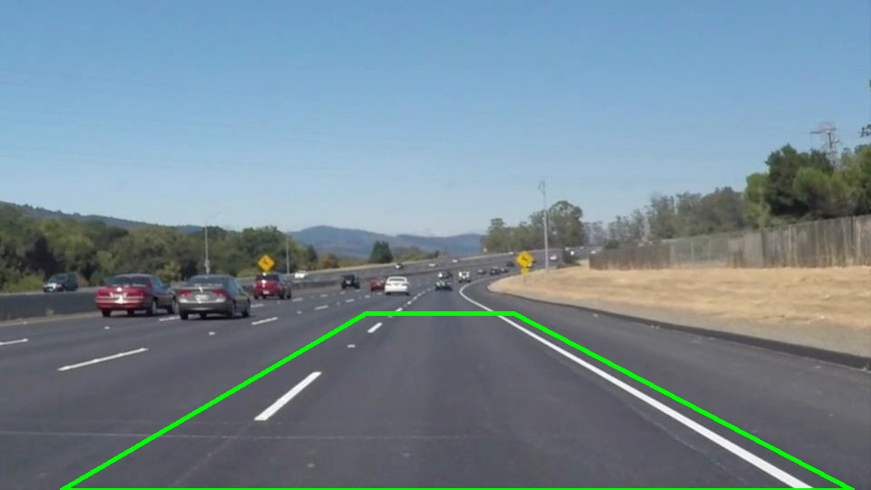
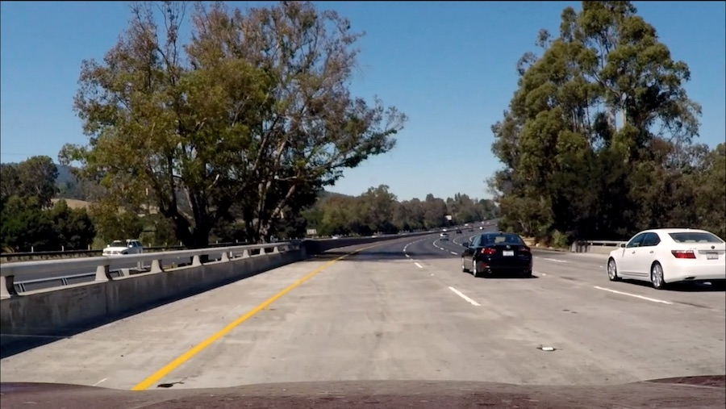
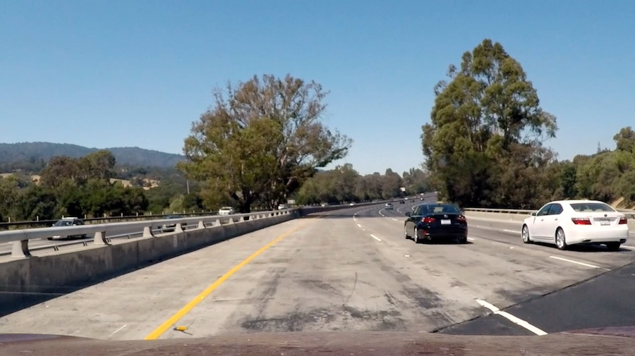
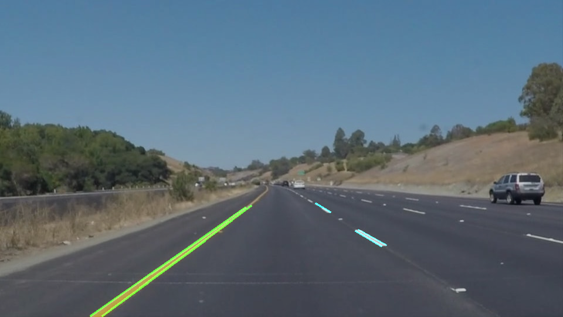
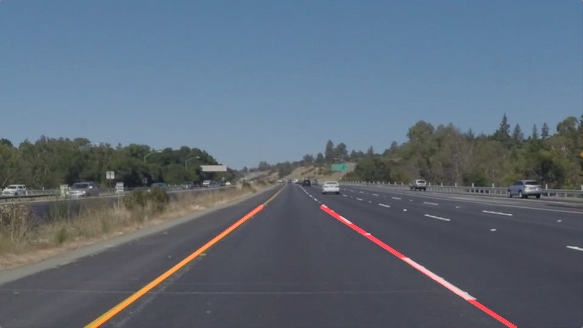

# **Finding Lane Lines on the Road** 

**Finding Lane Lines on the Road**

The goals / steps of this project are the following:
* Make a pipeline that finds lane lines on the road
* Reflect on your work in a written report

---

### Reflection

### 1. The pipeline

My pipeline consisted of 6 steps:
- converting the images to grayscale
- applying a Blur filter
- applying the Canny edges detector
- finding a region of interest
- using the Hough algorithm for finding lines
- drawing a single line on the left and right lanes

**1.1. Converting the images to grayscale**

First, I converted the images to grayscale using `cv2.cvtColor(img, cv2.COLOR_RGB2GRAY)`.

**1.2. Applying a Blur filter**

Then I applied a Blur filter with kernel size equal to 5. This default value worked well for me.

**1.3. Applying the Canny edges detector**

Choosing the low and high thresholds I wanted to get rid of as many noise as I can, meanwhile keeping enough "useful" pixels.
After running a plenty of tests I chose 30 and 60 as the values of the low and high threshold respectively.

**1.4. Finding a region of interest**

At this step I tried to exclude from the region of interest as many useless pixels as I can.
The final region of interest looks like this:

**1.5. Using the Hough algorithm for finding lines**

This step was challenging as I needed to choose parameters which must work well for all the test videos.
I found two video frames on which my pipeline did not work well, and tuned the
parameters until the algorithm gives good results.

Frame 1:

Frame 2

**1.6. Drawing a single line on the left and right lanes**

In order to draw a single line on the left and right lanes, I modified the `draw_lines()` function by adding 4 steps:
- Assigning all the lines to the left and right lanes (meanwhile filtering horizontal lines). The result of this step looks like this:
  
- Calculating average slope and x-intercept for the left and right lanes
- Filtering the slope and x-intercept using low pass filters. I decided to use a
  low pass filter to make my pipeline less sensitive to a noise. It was a crucial step for getting acceptable results for the last video.
- Extrapolating the lines to get the final result. The final result looks like this:
  

### 2. Potential shortcomings

One potential shortcoming would be what would happen when ... 

Another shortcoming could be ...

### 3. Possible improvements

A possible improvement would be to ...

Another potential improvement could be to ...
